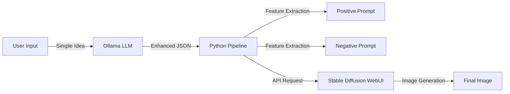

# 🎨 Local Multimodal Image Generation Pipeline
### Powered by Ollama & Stable Diffusion


## 🚀 Overview

The **Local Multimodal Image Generation Pipeline** is a sophisticated automation tool that bridges the gap between Large Language Models (LLMs) and Image Generation. It uses a local **Ollama** instance to act as an "expert prompt engineer," refining simple user concepts into highly detailed, negative-prompt-aware instructions, which are then automatically fed into a local **Stable Diffusion WebUI** instance to generate stunning artwork.

Stop struggling with complex prompt syntax—let your local AI handle the creative direction while you focus on the big picture.

---

## ✨ Key Features

*   **🤖 AI-Powered Prompt Engineering**: Uses `brxce/stable-diffusion-prompt-generator` via Ollama to expand simple ideas like "a cat" into professional, descriptive prompts with lighting, style, and camera details.
*   **⚔️ Intelligent Negative Prompting**: Automatically generates and parses negative prompts to ensure high-quality output (removing deformities, blur, etc.).
*   **🔄 Auto-Model Switching**: Detects available checkpoints in your Stable Diffusion directory and programmatically switches the active model via API.
*   **🔌 Seamless API Integration**: Connects purely via local APIs (`localhost:11434` for Ollama and `127.0.0.1:7860` for SD), ensuring a lightweight and modular architecture.
*   **🔒 100% Private & Offline**: No cloud keys, no subscription fees, and no data leaving your machine.

---

## 🛠️ Architecture Workflow



---

## 📋 Prerequisites

Before running the script, ensure you have the following services running locally:

### 1. Ollama (Local LLM)
*   **Install**: [Ollama.com](https://ollama.com)
*   **Pull Model**:
    ```bash
    ollama pull brxce/stable-diffusion-prompt-generator
    ```
*   **Run Service**:
    ```bash
    ollama serve
    ```

### 2. Stable Diffusion WebUI (Automatic1111)
*   Must be running with the API enabled.
*   **Launch Command**:
    ```bash
    ./webui-user.bat --api --no-half
    ```
    *(Note: `--api` is strictly required)*

---

## ⚙️ Configuration

Open `ollama_Image_PromptGenerator.py` and update the following configuration block to match your local paths:

```python
# 🔧 CONFIGURATION in script

# Path to your Stable Diffusion models directory
MODEL_FOLDER_PATH = r"C:\path\to\your\stable-diffusion-webui\models\Stable-diffusion"

# API Endpoints (Default)
SD_API_URL = "http://127.0.0.1:7860"
OLLAMA_URL = "http://localhost:11434/api/generate"
```

---

## 🚀 Installation & Usage

1.  **Clone the Repository**
    ```bash
    git clone https://github.com/yourusername/Local-Multimodal-Image-Generation.git
    cd Local-Multimodal-Image-Generation
    ```

2.  **Install Python Dependencies**
    ```bash
    pip install requests pillow torch torchvision
    ```

3.  **Run the Generator**
    ```bash
    python ollama_Image_PromptGenerator.py
    ```

4.  **View Results**
    *   The script will print the enhanced prompts to the console.
    *   Generated images will be saved in the current directory as `sd_generated_output_...png`.

---

## 📊 Example Output

| Input Idea | Enhanced Prompt (Generated by Ollama) | Result |
|:---|:---|:---:|
| *"A futuristic city"* | *"Cyberpunk metropolis at night, neon lights, rain-slicked streets, towering skyscrapers, volumetric fog, cinematic lighting, 8k resolution, unreal engine 5 render..."* | *[Image]* |

---

## 🧩 Troubleshooting

*   **❌ Connection Refused**: Ensure both `ollama serve` and SD WebUI are running. Check ports `11434` and `7860`.
*   **⚠️ Model Not Found**: Verify the `MODEL_FOLDER_PATH` in the script points to your actual `.safetensors` directory.
*   **🐢 Slow Generation**: Reduce `steps` (default: 25) or `width`/`height` in the script's payload configuration.

---

## 🤝 Contributing

Contributions are welcome! Feel free to submit pull requests for:
*   Support for ComfyUI API.
*   Advanced distinct negative prompt parsing.
*   Batch processing features.

---

## 📄 License

Distributed under the MIT License.
